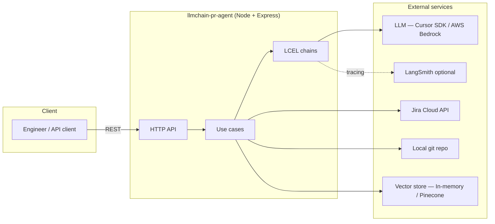
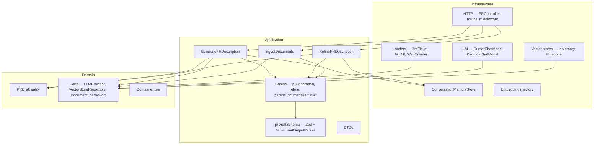
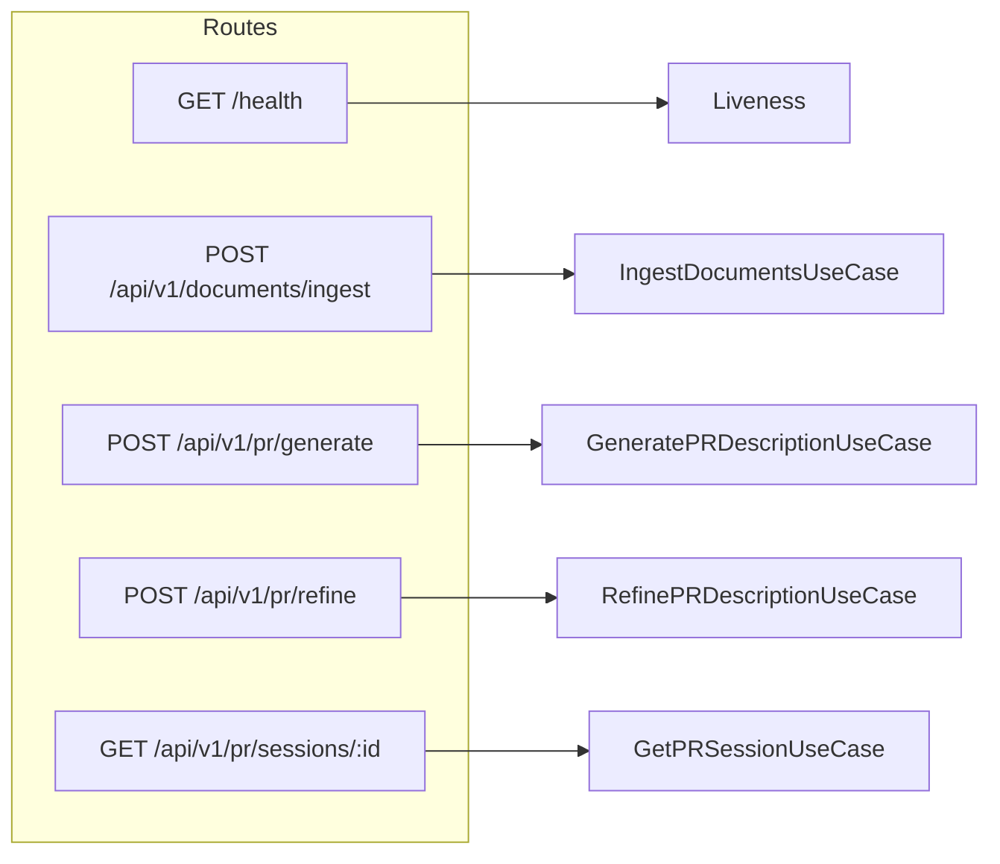
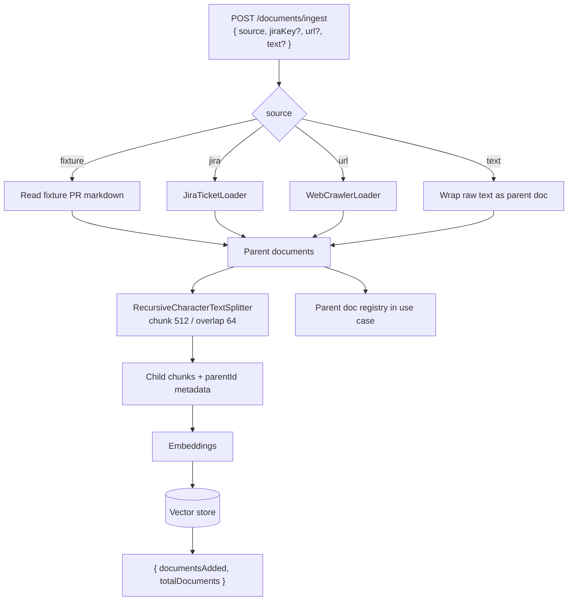
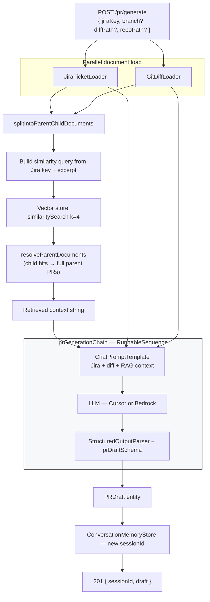
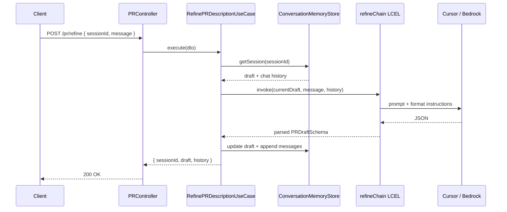
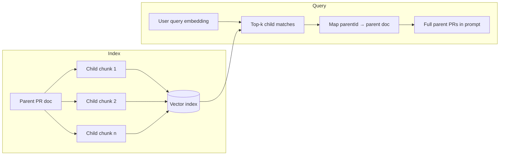
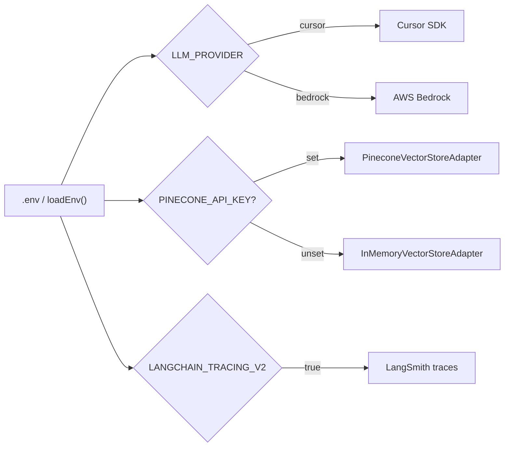

# Architecture

Mermaid diagrams for the **LLM Chain PR Description Agent**. Render in GitHub, GitLab, VS Code (Mermaid preview), or [mermaid.live](https://mermaid.live).

## System overview



## Clean Architecture layers

Dependency direction: **infrastructure → application → domain**. Domain has no outward imports.



## API surface



| Method | Path | Use case |
|--------|------|----------|
| `GET` | `/health` | Liveness |
| `POST` | `/api/v1/documents/ingest` | `IngestDocuments` |
| `POST` | `/api/v1/pr/generate` | `GeneratePRDescription` |
| `POST` | `/api/v1/pr/refine` | `RefinePRDescription` |
| `GET` | `/api/v1/pr/sessions/:id` | `GetPRSession` |

## Flow A — Document ingestion (index time)

Builds the RAG corpus from fixtures, Jira, URLs, or raw text. Child chunks are embedded and stored; parent documents are kept in memory for parent-document retrieval.



## Flow B — PR generation (query time)

Loads live Jira + git diff, retrieves similar past PRs, runs an LCEL chain, and returns structured JSON plus a session id for refinement.



**Output shape:** `title`, `summary`, `changes[]`, `testPlan`, `risks[]`, `jiraKey`, `metadata`.

## Flow C — PR refinement (multi-turn)

No vector retrieval; uses in-memory session draft + chat history.



## Parent-document retrieval

Small chunks improve search precision; full parent documents give the LLM complete PR context.



## Provider configuration



## Source layout

```
src/
  domain/          # PRDraft, ports, domain errors
  application/     # Use cases, DTOs, LCEL chains, Zod schemas
  infrastructure/  # Express, loaders, LLM adapters, vector stores, memory
  shared/          # Config, logger
```
